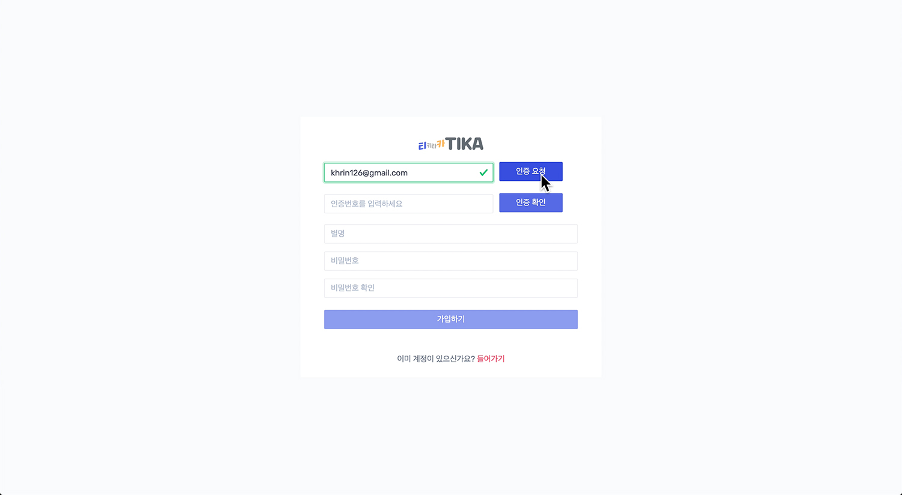

# TIKA
2020년 2월 중반 부터 5개월간 bitcamp 교육센터에서 교육을 받은 비전공자 5명이 한달여간 개발한 프로젝트.  
__본인 참여 :__  UI / Kanban / Calendar   

'TIKA' 는 티키타카 의 준 말로 팀원 간의 다양한 의사소통에 초점을 맞춘 협업툴 이다.
회원은 TIKA 에 가입하여 그룹단위로 팀을 관리할 수 있으며 팀 안에서 __<span style="color:#00BFFF">채팅 / 게시판 / 칸반 / TO-DO List</span>__ 등을 활용하여 팀원과 소통할 수 있다.
__<span style="color:#00BFFF">google 클라우드를</span>__  사용하여 파일을 공유 할 수도 있으며 __<span style="color:#00BFFF">캘린더를 활용한 일정 공유, 웹소켓이 적용된 실시간 그림판을</span>__  통해 의견을 공유할 수있다. 


### 개발 환경
JDK : jdk 1.8.0_16  
DBMS : MySQL  
WAS : Apache Tomcat v9.0  
IDE : Spring Tool Suite 3.9.4.release  
OS : Window 100 64bit  


<div className="Image__Small">
  
</div>

## 기능
#### 회원가입 / 로그인
- 이메일 인증을 통한 회원가입
- 로그인 화면에서 소셜 로그인, 회원가입 가능

<div className="Image__Medium">
  
</div>

<div className="Image__Medium">
  
</div>

<div className="Image__Medium">
  
</div>

<div className="Image__Medium">
  
</div>

<div className="Image__Medium">
  
</div>


#### Team 관리
- 새로운팀 생성 (초기생성자가 팀 리더)
- 사용자가 속해있는 팀 그룹 기능 제공, Drag&Drop 으로 그룹 관리
- 팀명 / 팀 참여 사용자 프로필 제공

<div className="Image__Medium">
  
</div>

#### Team Main

- Chart js 를 적용하여 팀&프로젝트 상황을 차트로 표현
- mysql 의 trigger 를 통해 타임라인을 구성, link 를 통해 해당 게시글로 이동 가능

<div className="Image__Medium">
  
</div>

#### Side Menu
- 팀원초대 : Autocomplete 를 통하여 가입된 회원 ID(db에 저장된) 자동 완성 
- 게시판 생성 : 일반게시판 / 칸반게시판 선택하여 게시판 생성
- 팀 탈퇴 : 팀 탈퇴시 팀 리더의 경우 리더권한을 팀내 멤버에게 양도한뒤 탈퇴. 리더가 아닐경우 일반 탈퇴

<div className="Image__Medium">
  
</div>


#### 일반 게시판

- Datatable 을 통해 게시판의 페이징/검색 구현  
- 공지사항 등록 기능, 답글 작성 기능

<div className="Image__Medium">
  
</div>

- Summernote editer 사용히여 게시글 작성, 이미지 미리보기 구현
- Multipart를 이용한 파일 업로드 구현

<div className="Image__Medium">
  
</div>

- 댓글 등록, 수정, 삭제 비동기 처리  

<div className="Image__Medium">
  
</div>


#### KANBAN

Jquery 를 이용한 Kanban Board 

<div className="Image__Medium">
  
</div>

- Sortable UI를 이용하여 Drag&Drop 구현  
- 리스트 추가/수정/삭제 비동기 처리  
- 리스트내 카드 추가/수정/삭제 비동기 처리  

<div className="Image__Medium">
  
</div>

- 카드 Detail 모달을 사용하여 구현
- Multipart 를 이용하여 다중파일 업로드 구현 


<div className="Image__Medium">
  
</div>

- 댓글 등록/수정/삭제 비동기 처리


#### Full Calendar 

<div className="Image__Medium">
  
</div>

- 일정 등록 / 수정 / 삭제 비동기 처리  
- 드래그앤드랍 / 리사이즈시 일정 자동 수정 비동기 처리


#### To-do List
Vue js 로 구현 

<div className="Image__Medium">
  
</div>

- All / Active / Done 탭 으로 구분
- List 추가 / 삭제 비동기 처리   

#### 그림판
Websocket을 이용한 팀별 실시간 드로잉

<div className="Image__Medium">
  
</div>

#### Chat
Bootstrap Popover로 채팅 UI 구현  
Websocket을 이용한 팀별 실시간 채팅

<div className="Image__Medium">
  
</div>

#### google cloud

일반 / Kanban 게시판 에서 이루어지는 파일 업로드, 삭제 모두 google cloud 와 연동

<div className="Image__Medium">
  
</div>


### 사용 기술

- Font  
<div className="Image__Medium">
  
</div>  
- Back
<div className="Image__Medium">
  
</div>
- API
<div className="Image__Medium">
  
</div>
- Toolkit & Cooperation
<div className="Image__Medium">
  
</div>

## Usecase Diagram
<div className="Image__Medium">
  
</div>

## DB Modeling(ERD)
<div className="Image__Medium">
  
</div>

## 구현

### Kanban
__Drag&Drop__  
협업툴을 구상하면서 kanban 보드를 구현하게 되었다. 초기의 목표는 [Trello](https://trello.com) 였다. Trello가 가지고 있는 기능은 전부 구현해 보고 싶었는데 몇가지 화면제어 이슈나 클라우드 이슈를 제외하곤 구현한것 같다.  
kanban 하면 생각나는 가장 핵심적인 기술은 Drag&Drop이다. 이를 구현하기 위해 jQuery 에서 제공하는 [Sortable UI](https://jqueryui.com/sortable/)를 사용하여 리스트와 카드 모두 Drag&Drop 가능하도록 하였다. 

#### FrontEnd

``` js
//리스트 그래그 앤 드롭 
 $('#kanban').sortable({ // 상위요소
   	 items: ".kanban-list-wrapper",
        itemOrientation: "horizontal",
        handle: ".kanban-list-title", 
        moveItemOnDrop: true,
        start( event, ui ){
       	 startListIDX = ui.item.index();
        },
        deactivate( event, ui ){
	       	 endListIDX = ui.item.index();
	       	 let currentListNo = ui.item.children().data('listno');
	       	 
	       	 if(!(startListIDX == endListIDX)){
	       		 $.ajax({
	       				url: "resortKanbanList.ajax",
	       				data: {
	       						"kanbanListNo": $.trim(currentListNo),
	       						"startListIDX": $.trim(startListIDX),
	       						"endListIDX": $.trim(endListIDX)
	       						},
	       				success: function() {
	       						},
	       				error: function(e){
	       				}
	       		 });
	       	 }
        },
        stop( event, ui ){
        	kanbanListArr = ui.item.parent().find('.kanban-list-content');
        	$.each(kanbanListArr, function(index, item){
        		$(item).attr('data-listindex', index); // 재정렬된 요소에 index 속성 새로 부여하기
        	});
        }
    });


 $('.divForDragNDrop').sortable({
	 connectWith: '.divForDragNDrop',
	 start( event, ui ){
		 currentCardNo = ui.item.data('cardno');
		 startCardIDX = ui.item.index();
		 startListNo = ui.item.parents('div.kanban-list-content').data('listno');
	 },
	 
	 receive: function(event, ui){ // 다른 리스트간 이동
		endCardIDX = ui.item.index();
       	endListNo = ui.item.parents('div.kanban-list-content').data('listno');
       	 
       	if(startListNo != endListNo){
       		 $.ajax({
       				url: "resortKanbanCard.ajax",
       				data: {
       						"allBoardListNo": $.trim($('#allBoardListNo').val()),
       						"kanbanCardNo": $.trim(currentCardNo),
       						"startListNo": $.trim(startListNo),
       						"endListNo": $.trim(endListNo),
       						"startCardIDX": $.trim(startCardIDX),
       						"endCardIDX": $.trim(endCardIDX) 
       						},
       				success: function() {
       						},
       				error: function(e){
       				}
       		 });
       	 }
	 },
	 stop( event, ui ){ // 같은 리스트 내에서 이동
     	
     	//같은 카드 내에서 이동될 경우 recive를 사용할 수 없다
     	endCardIDX = ui.item.index();
     	endListNo = ui.item.parents('div.kanban-list-content').data('listno');
     	
      	if((startListNo == endListNo) && (startCardIDX != endCardIDX)){
       		$.ajax({
       				url: "resortKanbanCard.ajax",
       				data: {
       						"allBoardListNo": $.trim($('#allBoardListNo').val()),
       						"kanbanCardNo": $.trim(currentCardNo),
       						"startListNo": $.trim(startListNo),
       						"endListNo": $.trim(endListNo),
       						"startCardIDX": $.trim(startCardIDX),
       						"endCardIDX": $.trim(endCardIDX) 
       						},
       				success: function() {
       						},
       				error: function(e){
       				}
       		 });
       	 }
	 }
 });
 
 
 
```


#### BackEnd
Drag&Drop 한 list와 card의 위치를 DB에 update 시키기 위한 로직  
```java

//리스트 드래그앤 드랍
    @Override
    public void resortKanbanList(int kanbanListNo, int startListIDX, int endListIDX) {
        dao.updateKanbanListIndex(kanbanListNo, endListIDX);
      
        if(endListIDX-startListIDX > 0) {
            // System.out.println("큰 index로 이동");
            // 중간 index들 -1
            dao.resortKanbanListIndexSTB(kanbanListNo, startListIDX, endListIDX);

        }else if(endListIDX-startListIDX < 0) {
            // System.out.println("작은 index로 이동");
            // 중간 index들 +1
            dao.resortKanbanListIndexBTS(kanbanListNo, startListIDX, endListIDX);
        }   
    }


    @Override
    public void resortKanbanCard(int kanbanCardNo, int startListNo, int endListNo, int startCardIDX, int endCardIDX) {
        if(startListNo == endListNo) { // 같은 리스트 내에서 카드 이동
            //업데이트
            dao.updateKanbanCardIndex(kanbanCardNo, endCardIDX);
        if(endCardIDX-startCardIDX > 0) {
            //System.out.println("큰 index로 이동");
            // 중간 index들 -1
            dao.resortKanbanCardIndexSTB(endListNo, kanbanCardNo, startCardIDX, endCardIDX);
        }else {
            //System.out.println("작은 index로 이동");
            // 중간 index들 +1
            dao.resortKanbanCardIndexBTS(endListNo, kanbanCardNo, startCardIDX, endCardIDX);
        }
         
        }else { // 다른 리스트간 카드 이동   
            //업데이트
            dao.updateKanbanCardIndexBL(kanbanCardNo, endListNo, endCardIDX);
            //정렬
            dao.resortStartKanbanCardIndex(startListNo, startCardIDX);
            dao.resortEndKanbanCardIndex(endListNo, endCardIDX, kanbanCardNo);
      }
   }
```

### FullCalender
__API__
FullCalender 는 자바스크립트 기반 오픈소스 라이브러리로 달력과 일정등 스케줄의 구현시 가장 많이 사용 되는 라이브러리이다. 라이브러리이니 바로 적용 시키면 될줄 알았는데 의외로 애를 먹인 녀석 이었다. 라이브러리의 버전이 새로 출시되면서 구성이 상당부분 바뀌게 되어 한글로 작성되어 있던 예제가 무용지물이 되었다. 그래서 공식문서를 들여다 보며 하나식 코드로 테스트를 진행하면서 작업했다. 날짜입력 에는 bootstrap의 datetimepicker를 사용하였고 Moment js 를 사용하여 조작하였다. 

#### FrontEnd
``` js

////////재사용성을 위해 따로 작성한 함수/////////

//캘린더 리사이즈 될때 새로운 날짜 불러오는 함수
function calDateWhenResize(event) {

    var newDates = {
        startDate: '',
        endDate: ''
    };
    if (event.allDay) {
        newDates.startDate = moment(event.start._d).format('YYYY-MM-DD');
        newDates.endDate = moment(event.end._d).format('YYYY-MM-DD HH:mm');
    } else {
        newDates.startDate = moment(event.start._d).format('YYYY-MM-DD HH:mm');
        newDates.endDate = moment(event.end._d).format('YYYY-MM-DD HH:mm');
    }
    return newDates;
}

//캘린더 드래그앤 드랍시 새로운 날짜 불러오는 함수
function calDateWhenDragnDrop(event) {

    // 드랍시 수정된 날짜반영
    var newDates = {
        startDate: '',
        endDate: ''
    }
    // 날짜 & 시간이 모두 같은 경우
    if(!event.end) {
        event.end = event.start;
    }
    // all day 일때
    if (event.allDay && event.end !== null) {
        console.log('1111')
        newDates.startDate = moment(event.start._d).format('YYYY-MM-DD');
        newDates.endDate = moment(event.end._d).format('YYYY-MM-DD HH:mm');
    }
    // all day가 아닐때
    else if (!event.allDay) {
        newDates.startDate = moment(event.start._d).format('YYYY-MM-DD HH:mm');
        newDates.endDate = moment(event.end._d).format('YYYY-MM-DD HH:mm');
    }
    return newDates;
}

//////////////////////////////////////

...

    // 일정 리사이즈
    eventResize: function (event, delta, revertFunc, jsEvent, ui, view) {
        $(".fc-body").unbind('click');
        $('.popover').remove();

        /**
         * 리사이즈시 수정된 날짜반영 하루를 빼야 정상적으로 반영됨.
         */
        var newDates = calDateWhenResize(event);

        // 리사이즈한 일정 업데이트
        $.ajax({
            url: "updatePlanDrag.ajax",
            data: {
            no : event.no,
            start : newDates.startDate,
            end : newDates.endDate
            },
            success: function (response) {
            alert('수정: ' + newDates.startDate + ' ~ ' + newDates.endDate);
            }
        });
    },

    eventDragStart: function (event, jsEvent, ui, view) {
        draggedEventIsAllDay = event.allDay;
    },

    // 일정 드래그앤드롭
    eventDrop: function (event, delta, revertFunc, jsEvent, ui, view) {
        $('.popover.fade.top').remove();
        // 주,일 view일때 종일 <-> 시간 변경불가
        if (view.type === 'agendaWeek' || view.type === 'agendaDay') {
            if (draggedEventIsAllDay !== event.allDay) {
                alert('드래그앤드롭으로 종일<->시간 변경은 불가합니다.');
                location.reload();
                return false;
            }
        }

        // 드랍시 수정된 날짜반영
        var newDates = calDateWhenDragnDrop(event);

        // 드롭한 일정 업데이트
        $.ajax({
            url: "updatePlanDrag.ajax",
            data: {
                no : event.no,
                start : newDates.startDate,
                end : newDates.endDate
            },
            success: function (response) {
            alert('수정: ' + newDates.startDate + ' ~ ' + newDates.endDate);
            }
        });
  },

```
#### BackEnd
Calendar 객체가 해당 정보를 전부 가지고 있기 때문에 객체로 업데이트해주면 된다.
```java
@RequestMapping("updatePlanDrag.ajax")
public void updatePlanDrag(Calendar calendar) {
	service.updatePlanDrag(calendar);
}
```

## 프로젝트를 끝낸 후
칸반을 메인으로 프로젝트에 참여 했기 때문에 js를 주로 사용 하였는데 vanilla js보다 jquery를 더 많이 사용한점. 원래 6개월이었던 과정이 5개월로 줄어들어 시간적 여건이 부족한탓에 js를 충분히 공부하지 못하고 프로젝트를 진행했다. 더 빨리결과를 만들어 내기위해 jquery를 사용하였지만 이후 react를 접하고 vanilla js를 공부해야겠다는 생각이 들었다.

