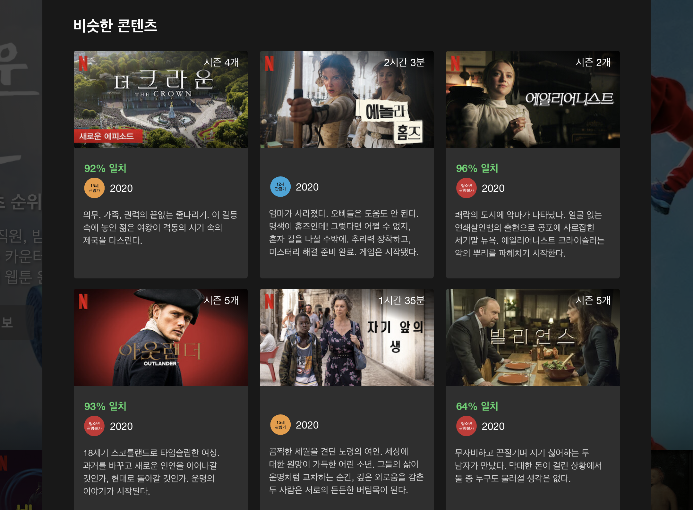
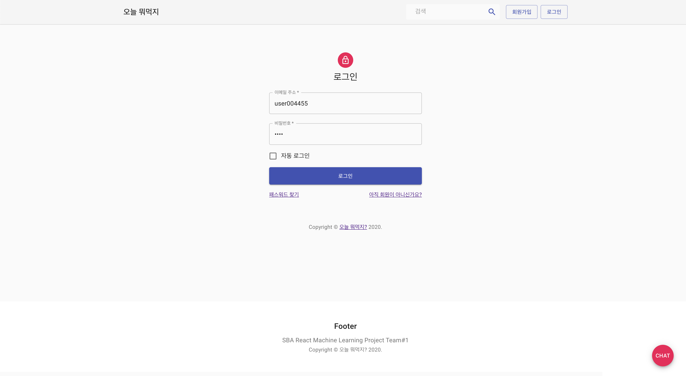
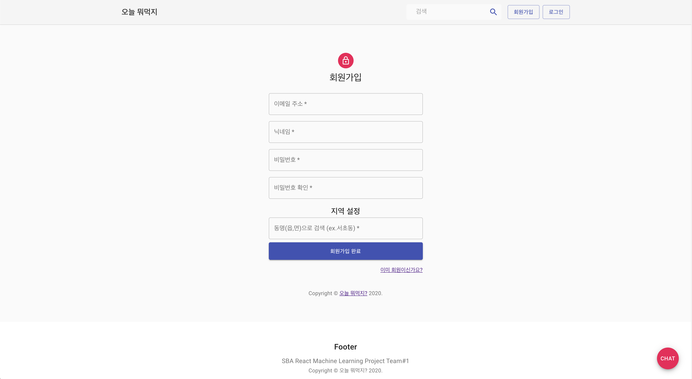
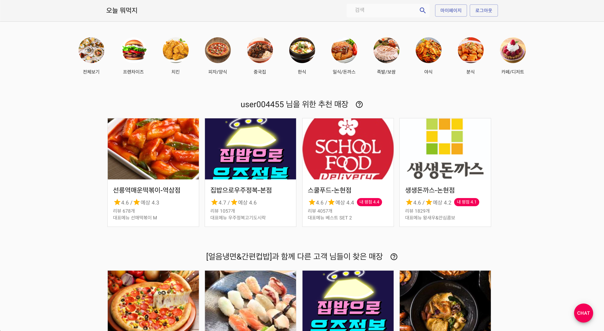
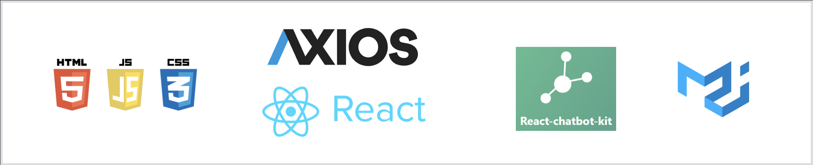
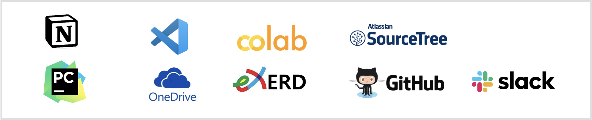
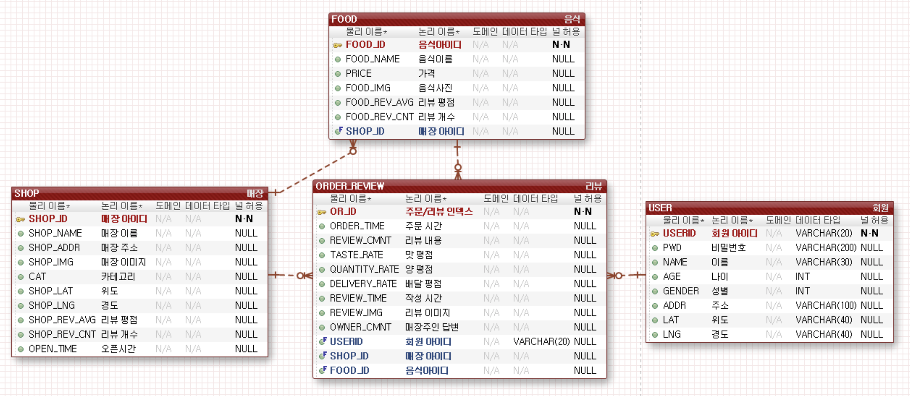
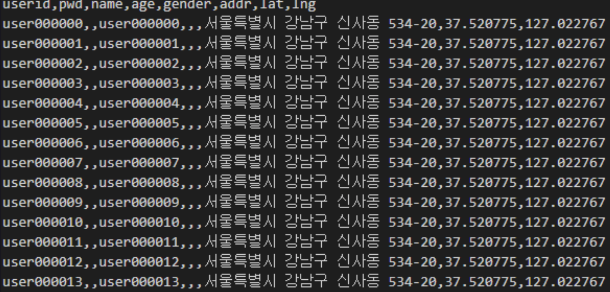

# 오늘 뭐먹지?
2020년 9월 부터 서울산업진흥원 에서 두달여간 진행한 머신러닝 딥러닝을 위한 AI전문가 양성 과정
중 한달간 개발한 프로젝트

배달 음식도 영화 처럼 내 취향을 분석해서 추천해줄순 없을까? 라는 생각에서 시작된
머신러닝 프로젝트 '오늘 뭐먹지?'는 요기요 오픈 api를 활용하여 제작된 배달 웹서비스 이다.  
개인화된 __<span style="color:#00BFFF">추천시스템(기 사용자의 평점분석)</span>__ 과 __<span style="color:#00BFFF">챗봇(키워드 분석)</span>__ 을 탑제하여 보다 만족도 높은 배달서비스를 제공한다. 


<!-- 
#### 배달 음식도 실패하면 슬프니까
<div className="Image__Small">
  
</div> -->

## 기능

#### 회원가입/로그인
개인화 추천 시스템의 특성상 주문정보가 생성된 유저의 아이디로 test 하는것이 보다 정확도를 높일수 있다.  
<div className="Image__Medium">
  
</div>

<div className="Image__Medium">
  
</div>

#### 추천 매장 시스템

<div className="Image__Medium">
  
</div>

<div className="Image__Medium">
  
</div>

## 사용 기술

- Font  
<div className="Image__Medium">
  
</div>  
- Back
<div className="Image__Medium">
  
</div>
- Machine Learning
<div className="Image__Medium">
  
</div>
- Toolkit & Cooperation
<div className="Image__Medium">
  
</div>


## DB Modeling(ERD)
<div className="Image__Medium">
  
</div>


## 구현
배달 서비스를 구현 하기로 결정한뒤 머신러닝을 위한 데이터 셋을 구해야했다.  SK telecom 에서 제공하는 [배달음식점 음성 통화 데이터](https://www.bigdatahub.co.kr/product/view.do?pid=1002333)와 공공데이터 포탈에서 제공하는 [서울시 음식점 현황](https://www.data.go.kr/data/15035759/fileData.do) 데이터 셋을 구할 수 있었지만, 러닝에 활용할 수도 없었고 웹을 구성할 수도 없는 데이터였다.  
위치별 가게정보/주문정보/리뷰내용 등이 우리에게 필요한 데이터 였기에 해당 정보로 웹서비스를 하고있는 요기요를 크롤링 하여 데이터셋을 확보 하였다.  
하지만 요기요에서도 개인정보는 제공해주지 않으므로 한정된 정보와 위치 정보를 결합하여 User 데이터를 가공하였다.

##### bitcamp 서초 본점을 중심으로 반경 1km단위로 매장과 유저를 필터링 하여 가공  [(taepd)](https://github.com/taepd)
```python
class Preprocessor:
df = pd.read_csv(file_path, sep=',', encoding='utf-8-sig')
print('오더리뷰 csv로딩')
print('메뉴 csv로딩')
print('위경도 csv로딩')

...

for idx in range(5, 6):

    ...

    # 기준점으로 부터 반경 1km 이내의 매장만 필터링
    def filter_shop(i):
        one_row = df[df['shop_id'] == i].head(1)
        if haversine(target_geo_list,
                     [one_row['lat'].head(1), one_row['lng'].head(1)]) <= 1:
            return i

    filtered_shop_list = list(filter(filter_shop, shop_list))

    ...

    # 기준점 내의 매장에 리뷰를 쓴 아이디 리스트 필터링
    user_list = []

    for shop in filtered_shop_list:
        nickname = df[df['shop_id'] == shop]['nickname'].tolist()
        user_list.append(nickname)

    # flatten(1차원 리스트화)
    user_list = sum(user_list, [])
    user_list = list(set(user_list))

    ...

    for user in user_list:
        # user DateFrame 생성
        # 유저 아이디 생성
        userid = f'user{str(count).zfill(6)}'
        lat = target_lat
        lng = target_lng
        addr = point_df.loc[idx]['addr']
        
        ...
        
        for shop in filtered_shop_list:
            is_shop_user = (df['shop_id'] == shop) & (df['nickname'] == user)
            user_review_list = df[is_shop_user]
        ...

        user_df.to_csv(f'user_df({target_lat}, {target_lng}).csv', ...)
        df.to_csv(r'./../../data/csv/important/review_df.csv', ...)

```

#### 가상의 고객님들 탄생
<div className="Image__Small">
  
</div>


### 챗봇


## Links

[I'm an inline-style link](https://www.google.com)

[I'm an inline-style link with title](https://www.google.com "Google's Homepage")

[I'm a reference-style link][arbitrary case-insensitive reference text]

[I'm a relative reference to a repository file](../blob/master/LICENSE)

[You can use numbers for reference-style link definitions][1]

Or leave it empty and use the [link text itself].

URLs and URLs in angle brackets will automatically get turned into links.
http://www.example.com or <http://www.example.com> and sometimes
example.com (but not on Github, for example).

Some text to show that the reference links can follow later.

[arbitrary case-insensitive reference text]: https://www.mozilla.org
[1]: http://slashdot.org
[link text itself]: http://www.reddit.com

## Images

<div className="Image__Small">
  
</div>

Lorem Ipsum is simply dummy text of the printing and typesetting industry. Lorem Ipsum has been the industry's standard dummy text ever since the 1500s, when an unknown printer took a galley of type and scrambled it to make a type specimen book. It has survived not only five centuries, but also the leap into electronic typesetting, remaining essentially unchanged. It was popularised in the 1960s with the release of Letraset sheets containing Lorem Ipsum passages, and more recently with desktop publishing software like Aldus PageMaker including versions of Lorem Ipsum. Lorem Ipsum is simply dummy text of the printing and typesetting industry.

## Code and Syntax Highlighting

```javascript
var s = "JavaScript syntax highlighting";
alert(s);
```

```
No language indicated, so no syntax highlighting.
But let's throw in a <b>tag</b>.
```

### JSX

```jsx
import React from "react";
import { ThemeProvider } from "theme-ui";
import theme from "./theme";

export default props => (
  <ThemeProvider theme={theme}>{props.children}</ThemeProvider>
);
```

## Blockquotes

Lorem Ipsum is simply dummy text of the printing and typesetting industry. Lorem Ipsum has been the industry's standard dummy text ever since the 1500s, when an unknown printer took a galley of type and scrambled it to make a type specimen book. It has survived not only five centuries, but also the leap into electronic typesetting, remaining essentially unchanged. It was popularised in the 1960s with the release of Letraset sheets containing.

> Blockquotes are very handy in email to emulate reply text.
> This line is part of the same quote.

Lorem Ipsum is simply dummy text of the printing and typesetting industry. Lorem Ipsum has been the industry's standard dummy text ever since the 1500s, when an unknown printer took a galley of type and scrambled it to make a type specimen book. It has survived not only five centuries, but also the leap into electronic typesetting, remaining essentially unchanged. It was popularised in the 1960s with the release of Letraset sheets containing Lorem Ipsum passages, and more recently with desktop publishing software like Aldus PageMaker including versions of Lorem Ipsum

## Horizontal Rule

Horizontal Rule

Three or more...

---

Lorem Ipsum is simply dummy text of the printing and typesetting industry. Lorem Ipsum has been the industry's standard dummy text ever since the 1500s, when an unknown printer took a galley of type and scrambled it to make a type specimen book. It has survived not only five centuries, but also the leap into electronic typesetting, remaining essentially unchanged. It was popularised in the 1960s with the release of Letraset sheets containing Lorem Ipsum passages, and more recently with desktop publishing software like Aldus PageMaker including versions of Lorem Ipsum

---

Lorem Ipsum is simply dummy text of the printing and typesetting industry. Lorem Ipsum has been the industry's standard dummy text ever since the 1500s, when an unknown printer took a galley of type and scrambled it to make a type specimen book. It has survived not only five centuries, but also the leap into electronic typesetting, remaining essentially unchanged. It was popularised in the 1960s with the release of Letraset sheets containing Lorem Ipsum passages, and more recently with desktop publishing software like Aldus PageMaker including versions of Lorem Ipsum
