---
title: SBA React Machine Learning Project '오늘 뭐먹지?'
author: Park Hyejung
date: 2020-06-26
hero: ./images/hero.jpg
excerpt: 머신러닝을 활용한 개인화 추천 배달 웹서비스 오늘 뭐먹지??
--- 

# 오늘 뭐먹지?
2020년 9월 부터 서울산업진흥원 에서 두달여간 진행한 머신러닝 딥러닝을 위한 AI전문가 양성 과정
중 4명이 한달간 개발한 프로젝트  
__본인 참여 :__  UI / 리뷰 / 오더 / 검색형챗봇 /  

배달 음식도 영화 처럼 내 취향을 분석해서 추천해줄순 없을까? 라는 생각에서 시작된
머신러닝 프로젝트 '오늘 뭐먹지?'는 요기요 오픈 api를 활용하여 제작된 배달 웹서비스 이다.  
개인화된 __<span style="color:#00BFFF">추천시스템(기 사용자의 평점분석)</span>__ 과 __<span style="color:#00BFFF">챗봇(키워드 분석)</span>__ 을 탑제하여 보다 만족도 높은 배달서비스를 제공한다. 


<!-- ### 개발 환경
Front : React  
DBMS : MariaDB  
WAS : Flask  
IDE : Vscode   -->

<!-- 
#### 배달 음식도 실패하면 슬프니까
<div className="Image__Small">
  
</div> -->

## 기능

#### 회원가입 / 로그인  
<!-- - 개인화 추천 시스템의 특성상 유저는 회원가입을 한뒤 사이트를 이용할 수 있다. -->

###
  

<!-- 
<div className="Image__Small">
  
</div>

<div className="Image__Small">
  
</div> -->
##
#### 추천 매장 시스템
- surprise 라이브러리와 협업필터링 알고리즘을 이용하여 유저 예상평점을 구현  

<div className="Image__Medium">
  
</div>

__첫번째 메뉴 리스트__ : 사용자 기반 유사도를 분석하여 로그인 유저와 가장 유사한 유저들이 선호하는 아이템을 협업필터링과 하이브리드하여 추천  
__두번째 메뉴 리스트__ : 아이템 기반 유사도를 분석하여 로그인 유저가 높은 평점을 준 아이템과 가장 유사한 아이템을 협업필터링과 하이브리드하여 추천

<div className="Image__Medium">
  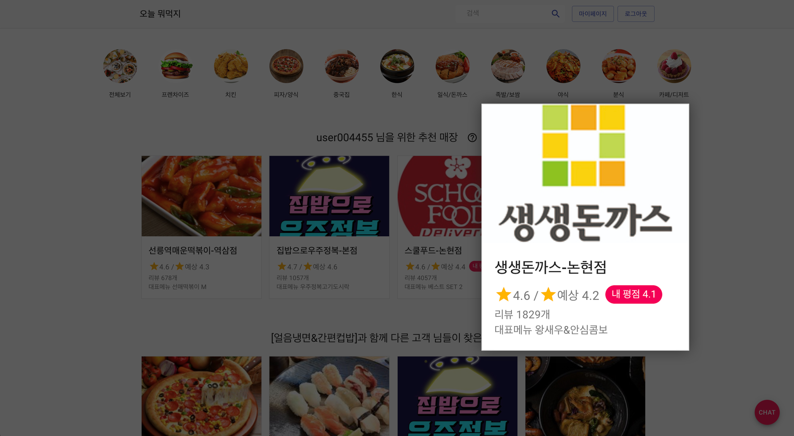
</div>

추천시스템의 예상평점과 실제 내가 남긴 평점의 유사도

##
#### 카테고리별 셀렉트 / 검색

<div className="Image__Small">
  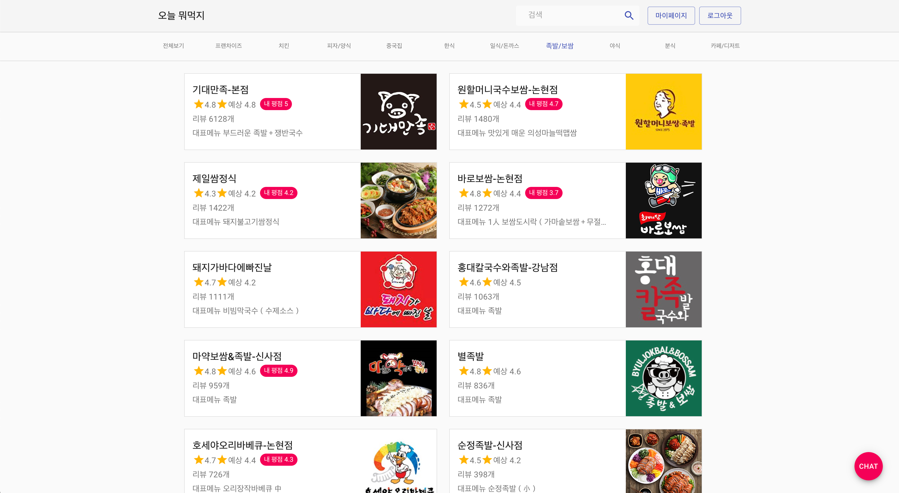
</div>

카테고리 별 매장 노출 마찬가지로 예상평점이 노출되는 모습 

<div className="Image__Small">
  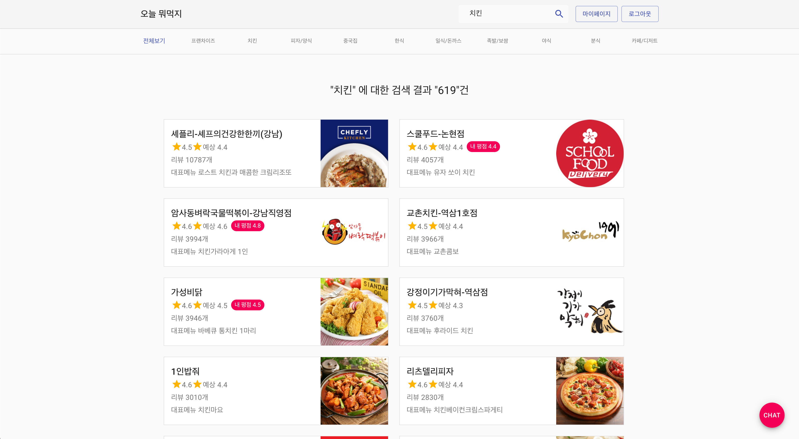
</div>

~~_'치킨 먹고싶다.'_~~

#### 매장 페이지 메뉴 / 리뷰 / 주문
- 매장을 클릭하여 접근한 페이지. 가장 먼저 매장에 대한 정보를 확인할 수 있고, 탭으로 구성된 메뉴에서는 해당 매장의 메뉴 정보와 리뷰 정보를 확인할 수있다. 
- 메뉴를 클릭하면 팝업창이 나타나 선택한 메뉴를 주문할 수 있다.
- 주문완료후 마이페이지를 통해 리뷰를 남길 수 있으며 사장님의 댓글도 확인할 수 있다.


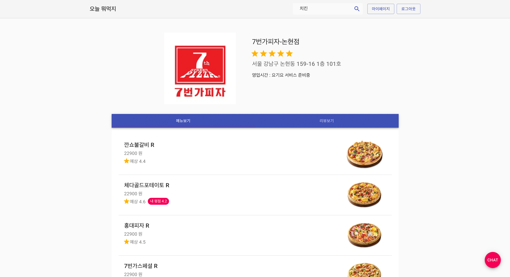  
<!-- 매장정보와(이름/평점/주소/영업시간) 메뉴정보(이름/가격/이미지/메뉴 예상평점) -->
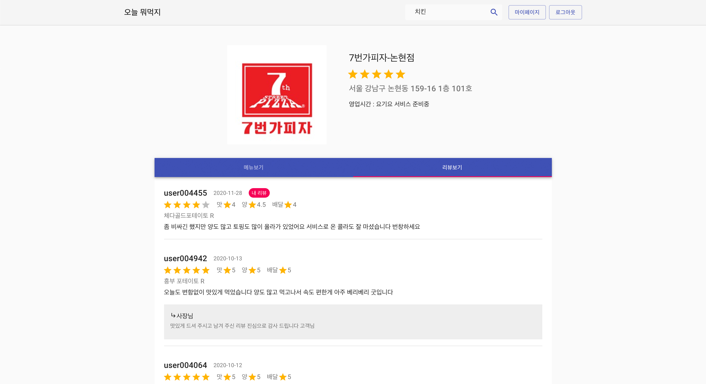  
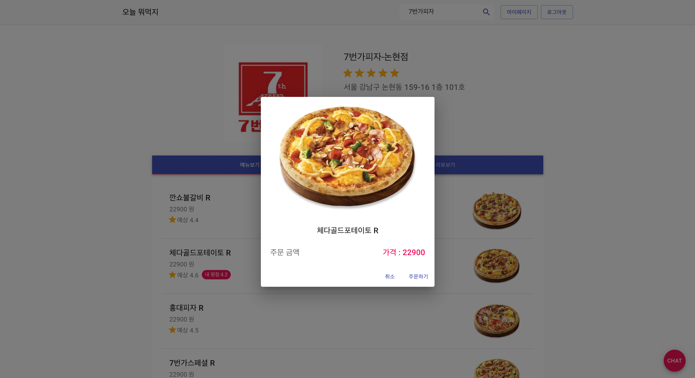  
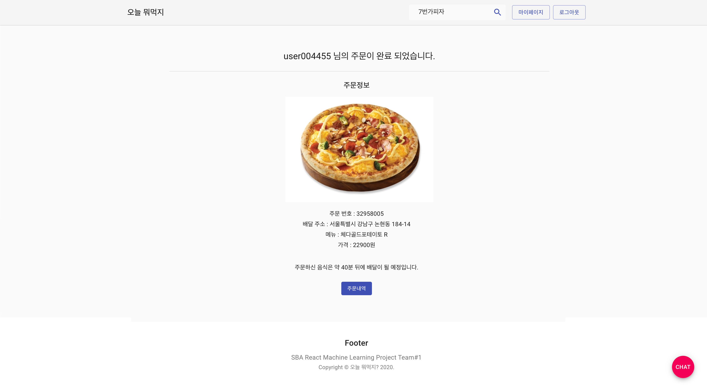  


#### 마이페이지 주문내역 / 리뷰작성
- 마이페이지의 주문내역은 주문완료후 (주문목록을 클릭/상단 네비게이션의 마이페이지를 클릭) 하여 접근 가능하다.
- 주문 내용을 클릭하면 해당 매장으로 이동하고, 리뷰쓰기를 클릭하면 리뷰 작성페이지로 이동한다.

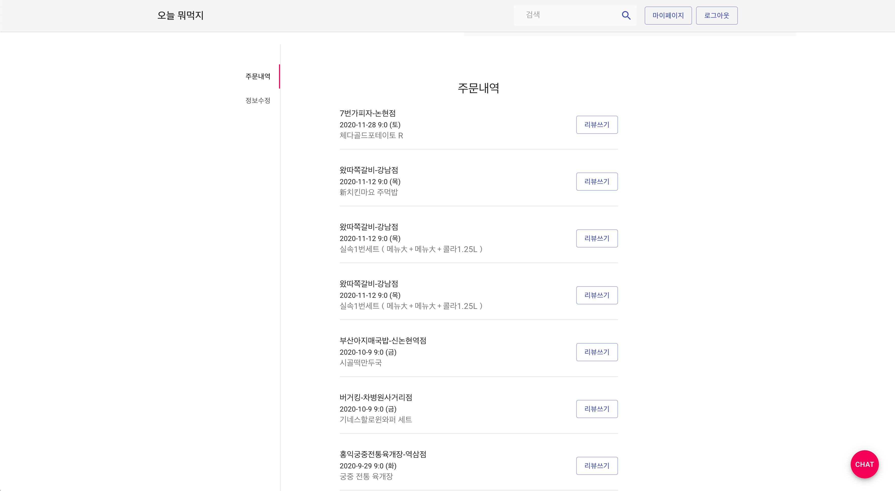  
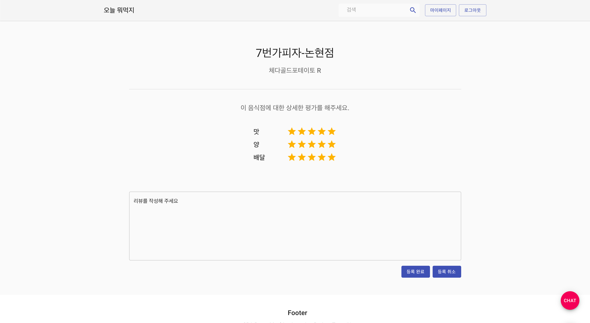  


#### 챗봇 검색 / 주문 
- __챗봇 구동 화면__ 입력받은 text를 형태소 분석기로 분석, 키워드('검색어') 와 카테고리로 분류 하여 대답 한다.

<div className="Image__Medium">
  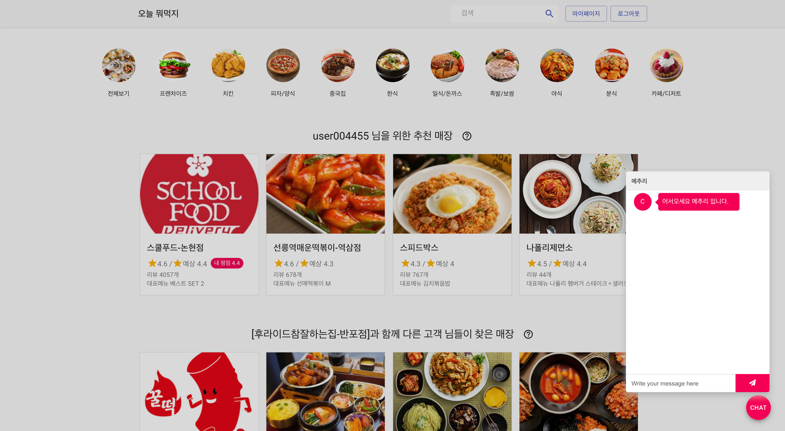
</div>

챗봇 아이콘을 클릭하면 어떤 페이지에서도 채팅 가능

<div className="Image__Medium">
  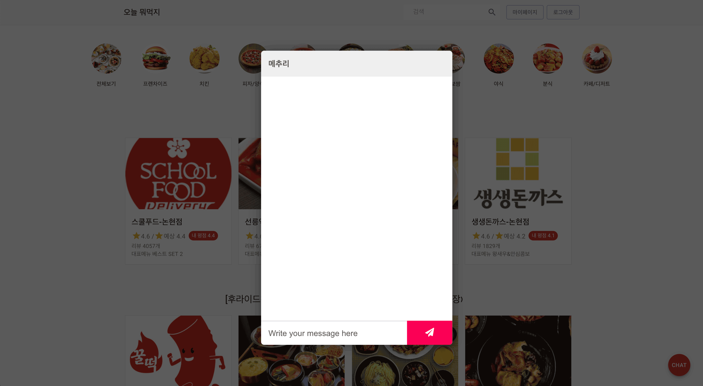
</div>


## 사용 기술

- Font  
<div className="Image__Medium">
  
</div>  
- Back
<div className="Image__Medium">
  
</div>
- Machine Learning
<div className="Image__Medium">
  
</div>
- Toolkit & Cooperation
<div className="Image__Medium">
  
</div>


## DB Modeling(ERD)
완벽한 웹서비스의 목적 보다 머신러닝과 웹서비스개발의 밸런스를 맞추기위해 DB는 비교적 간단하게 구성하였다.
<div className="Image__Medium">
  
</div>


## 구현

### BackEnd
__유저데이터__  
배달 서비스를 구현 하기로 결정한뒤 머신러닝을 위한 데이터 셋을 구해야했다.  SK telecom 에서 제공하는 [배달음식점 음성 통화 데이터](https://www.bigdatahub.co.kr/product/view.do?pid=1002333)와 공공데이터 포탈에서 제공하는 [서울시 음식점 현황](https://www.data.go.kr/data/15035759/fileData.do) 데이터 셋을 구할 수 있었지만, 러닝에 활용할 수도 없었고 웹을 구성할 수도 없는 데이터였다.  
위치별 가게정보/주문정보/리뷰내용 등이 우리에게 필요한 데이터 였기에 해당 정보로 웹서비스를 하고있는 요기요를 크롤링 하여 데이터셋을 확보 하였다.  

하지만 요기요에서도 개인정보는 제공해주지 않으므로 한정된 정보와(리뷰를 남긴 사용자 아이디 앞 2자리) 위치 정보를(매장의 위,경도) 결합하여 사용자 데이터 가공을 진행하였다.  
리뷰 데이터의 사용자 아이디를 매장반경1km 내로 잘라 한사람이라 가정하여 주문내역을 가진 사용자 11366명을 만들어낼수 있었다.(강남구,서초구 한정)
##### 요기요 사이트 크롤링 자동화 [(taepd)](https://github.com/taepd)
```python
class YogiyoCrawler:
    def get_json_store(self, start, end):
        json_list = []
        for index in range(start, end):
            index = str(index).zfill(6)
            url = f"https://www.yogiyo.co.kr/api/v1/restaurants/{index}"
            ajson = self.get_json(url)
            if isinstance(ajson, dict):
                json_list.append(ajson)
            print(f'{index}번 크롤링 중')
        
        file_path = f"./data/json/store/yogiyo_store({start}~{end}).json"
        with open(file_path, 'w', encoding='UTF-8-sig') as file:
            json.dump(json_list, file, indent=4, ensure_ascii=False)
        print(f'yogiyo_store({start}~{end}).json 저장완료')
        ...

if __name__ == '__main__':
    yogiyo = YogiyoCrawler()

    # 매장 크롤링
    start = 361000
    end = 362000
    for i in range(9):
        yogiyo.get_json_store(start, end)
        start += 1000
        end += 1000
    yogiyo.get_json_store(0, 1000)

```
##### bitcamp 서초 본점을 중심으로 반경 1km단위로 매장과 유저를 필터링 하여 가공  [(taepd)](https://github.com/taepd)
```python
class Preprocessor:
df = pd.read_csv(file_path, sep=',', encoding='utf-8-sig')
print('오더리뷰 csv로딩')
print('메뉴 csv로딩')
print('위경도 csv로딩')

...

for idx in range(5, 6):

    ...

    # 기준점으로 부터 반경 1km 이내의 매장만 필터링
    def filter_shop(i):
        one_row = df[df['shop_id'] == i].head(1)
        if haversine(target_geo_list,
                     [one_row['lat'].head(1), one_row['lng'].head(1)]) <= 1:
            return i

    filtered_shop_list = list(filter(filter_shop, shop_list))

    ...

    # 기준점 내의 매장에 리뷰를 쓴 아이디 리스트 필터링
    user_list = []

    for shop in filtered_shop_list:
        nickname = df[df['shop_id'] == shop]['nickname'].tolist()
        user_list.append(nickname)

    # flatten(1차원 리스트화)
    user_list = sum(user_list, [])
    user_list = list(set(user_list))

    ...

    for user in user_list:
        # user DateFrame 생성
        # 유저 아이디 생성
        userid = f'user{str(count).zfill(6)}'
        lat = target_lat
        lng = target_lng
        addr = point_df.loc[idx]['addr']
        
        ...
        
        for shop in filtered_shop_list:
            is_shop_user = (df['shop_id'] == shop) & (df['nickname'] == user)
            user_review_list = df[is_shop_user]
        ...

        user_df.to_csv(f'user_df({target_lat}, {target_lng}).csv', ...)
        df.to_csv(r'./../../data/csv/important/review_df.csv', ...)

```

#### 가상의 고객님들 탄생 (주소는 매장주소와 동일)
<div className="Image__Medium">
  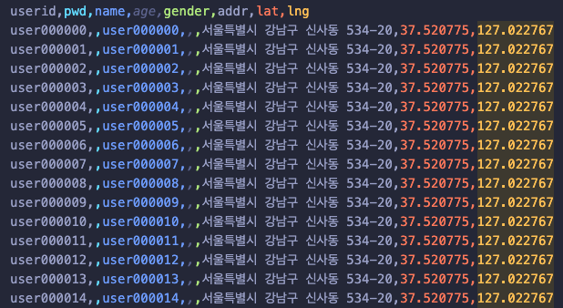
</div>


### 챗봇
__자연어__  
챗봇을 제작 하기전 필요한것 역시 데이터셋 이었는데 챗봇을 위한 QnA 형태의 데이터셋은 몇가지 존재 했지만 우리에게 필요한건 음식점에 대한 데이터였다. 마침 AI Hub에서 제공하고 있는 [소상공인 및 공공민원 분야에 대한](https://aihub.or.kr/aidata/85) 데이터셋이 음식점데이터를 포함하고 있었다.
해당 데이터셋을 가지고 초기 생성 챗봇을 구성하였으나 결과는 엉망이었다. 데이터셋이 우리가 원하던 대화의 형식과 맞지 않는 부분도 있었고 원하는 흐름으로 이어갈수도 없었다.  
그래서 검색 기반 챗봇 모델로 키워드만 추출하여 원하는 응답을 할수 있도록 하였다. 이 과정에서 기존에 사용하였던 질의응답 데이터셋 보단 의도를 분류할 수 있는 데이터셋이 필요하였다. 이에 원하는 entity를 사전형태로 구성한뒤 '추천', '주문', '인사', '언제' 4가지 의도에 따라 entity별 n by n개의 수로 정제된 list를 만들어 데이터셋으로 활용하였다.  
```csv
label,data
0,중식 메뉴
0,커피 메뉴
...
1,피자 배달
1,햄버거 배달
...
2,반가워 안녕
2,챗봇 안녕
...
3,점심 뭐 먹지
3,저녁에 뭐 먹을까
```
형태소 분석으론 komoran을 사용 하였다.
의도(label), 와 생성한 문장 (data) 로 이루어진 csv 파일을 부러와 각각 x_data, y_data 로 사용하였다.
TfidfVectorizer로 단어에 가중치를 부여, 핵심 키워드를 추출하여 단어사전을 제작 하고 MultinomialNB 를 사용하여 학습하였다.

``` python

##########데이터 전처리
...
# 텍스트 정제 (특수기호 제거)
for i, text in enumerate(x_data):
    text = re.sub(r'[^ ㄱ-ㅣ가-힣]', '', text) #특수기호 제거, 정규 표현식
    x_data[i] = text
...

#텍스트 정제 (어간 추출)
for i, text in enumerate(x_data):
    clean_words = komoran.nouns(text) 
    text = ' '.join(clean_words)
    x_data[i] = text
...

#단어 카운트 (가중치 부여)
transformer = TfidfVectorizer()
transformer.fit(x_data)
x_data = transformer.transform(x_data)

x_train, x_test, y_train, y_test = train_test_split(x_data, y_data, test_size=0.3, random_state=777, stratify=y_data)

##########모델 생성
model = MultinomialNB(alpha=1.0)

##########모델 학습
model.fit(x_train, y_train)

```
이후 사용자에게 입력받은 문장을 전처리를 통해 검색 키워드를 뽑아내고 학습이 완료 된 모델을 거쳐 의도를 분류 하였다.

``` python

def process_nb(text):

    ##########검색어 추출
    get_data_list = [text][0]
    morpphed_text = komoran.pos(get_data_list)

        tagged_text = ''
    for pos_tags in morpphed_text:
        if (pos_tags[1] in ['NNG','MAG', 'NNP','SL'] and len(pos_tags[0]) > 1): #Check only Noun
            feature_value = pos_tags[0]
            tagged_text = tagged_text + pos_tags[0] + ' '

    word = tagged_text.split(' ')
    word = word[0]
    print('검색어 추출',word)

    ##########모델
    x_data = np.array([ text ])

    #텍스트 정제 (어간 추출)
    for i, text in enumerate(x_data):
        clean_words = komoran.nouns(text) 
        text = ' '.join(clean_words)
        x_data[i] = text

    x_data = transformer.transform(x_data)
    y_predict = model.predict(x_data)
    text = labels[y_predict[0]]

    if text == '추천':
        return text, word
    elif text == '인사':
         return text, word
    elif text == '주문':
        return text, word
    elif text == '언제':
        return text, word
    elif x_data =='':
        text = 'none'
        return text

```

### FrontEnd
__React__
React Hook 을 활용하여 함수형 컴포넌트로 구성하였다.
사이트의 템플릿은 [MATERIAL-UI](https://material-ui.com/)를 이용하였다.


챗봇 UI는 처음에 [React Simple Chatbot](https://lucasbassetti.com.br/react-simple-chatbot/#/docs/form)로 작업 하였으나, step(순서)이 한번 구성되고 나면 바뀌지 않는다는 Simple Chatbot의 특성때문에 의도에 따라 움직여야 하는 챗봇을 구성할 수가 없었다.  그래서 [React-chatbot-kit](https://fredrikoseberg.github.io/react-chatbot-kit-docs/) 이라는 노르웨이의 개발자가 만든지 2달밖에 되지 않은 kit를 사용하게 되었다.
MessageParser / ActionProvider / config 로 구성 되어 있으며 각각 아래와 같은 작업을 한다.
- config : 챗봇의 구성 가능한 모든 요소를 ​​제어  
- MessageParser : 사용자가 메시지를 보낼 때 발생하는 일을 제어
- ActionProvider : 챗봇이 수행 할 작업의 종류를 제어

``` js

// MessageParser.jsx
// 의도에 따른 메세지 출력
parse(message) {
    console.log(message)
    let lowercase = message
    let key = ''
    const userid = sessionStorage.getItem("sessionUser");
    axios.get(`http://localhost:8080/chatbot/${lowercase}`)
      .then(res => {
        key = res.data[1]

        if (res.data[1].includes("추천")) {
          this.actionProvider.recommendSearchBotMessage(res.data[2], res.data[0][0], userid);
        }
        if (res.data[1].includes("주문")) {
          this.actionProvider.orderBotMessage(res.data);
        }
        if (res.data[1].includes("인사")) {
          if (userid != null) {
            this.actionProvider.greetingLoginUserBotMessage(userid);
          } else {
            this.actionProvider.greetingBotMessage();
          }
        }
        if (res.data[1].includes("언제")) {
          this.actionProvider.recommendBotMessage();
        }
```